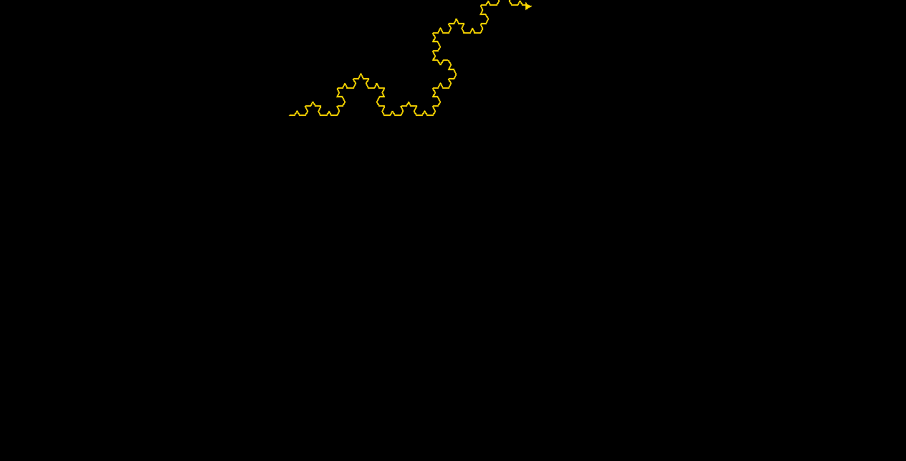

# Computação Gráfica - Fractal ⭐

<f2 align = "left"> **O seguinte projeto possui o objetivo de construir ilustrações por meio de repetições com fractal.**</f2> 

 

# Passo a passo

Para utilizar um módulo turtle no Python, utilizamos o comando import (importar) seguido do nome do módulo que queremos importar. Após a importação, já podemos utilizar todos os objetos e funções que o módulo disponibiliza.
   
  
    import turtle
    
 
 Assim, para importar o módulo de tempo, que fornece várias funções relacionadas ao tempo, usamos:

 
    import time
    

Defina duas constantes WIDTH e HEIGHT, com valores de 1600 e 900, respectivamente:
   
  
    WIDTH, HEIGHT = 1600, 900
  

 Cria um objeto screen a partir do módulo turtle e o atribua à variável de tela: 

    screen = turtle.Screen()

 Configura a tela com as dimensões WIDTH e HEIGHT especificadas:

  
    screen.setup(WIDTH, HEIGHT)

 Defina o tamanho da tela para o dobro das dimensões WIDTH e HEIGHT:

    screen.screensize(2*WIDTH, 2*HEIGHT)

 Defina a cor de fundo da tela, nesse caso escolhemos preto:

    screen.bgcolor('black')

 Defina o tempo de atraso da tela para 0, significando que o desenho será feito sem nenhum atraso:

    screen.delay(0)

 Crie um objeto Turtle a partir do módulo turtle e o atribui à variável trig: 

    trig = turtle.Turtle()

 Defina a largura da caneta da tartaruga para 2 pixels e a velocidade da tartaruga para 1 (sendo a mais lenta): 

    trig.pensize(2)
    trig.speed(1)
    

 Defina a posição inicial da tartaruga para ser 1/6 do caminho do canto inferior esquerdo da tela: 

    
    trig.setpos(-WIDTH // 6, HEIGHT // 6)
    

 Define a cor da tartaruga, nesse caso, para dourado: 

    trig.color('gold')

 Defina uma variável geração com valor 5, que é o número de gerações do triângulo de Sierpinski a serem gerada 

    generation = 5

 Defina um axioma de string com o padrão inicial para gerar o triângulo de Sierpinski e duas variáveis "chr_1" e "rule_1", que serão utilizadas para aplicar as regras recursivas para geração do triângulo:

    axiom = 'F++F++F'
    chr_1, rule_1 = 'F', 'F-F++F-F'
    

 Defina uma variável de passo com valor 600, que será usada para calcular o comprimento de cada segmento de linha do triângulo e um ângulo variável com valor de 60 graus, que será utilizado para calcular o ângulo de cada volta do triângulo: 

    step = 600
    angle = 60
    

 Defina uma função apply_rules que recebe um axioma de string como entrada e retorna uma nova string com as regras recursivas aplicadas e use uma compreensão de lista para iterar sobre cada caractere no axioma, aplicando a regra recursiva rule_1 a quaisquer ocorrências de chr_1 e retornando a string resultante.: 

    def apply_rules(axiom):
      return ''.join([rule_1 if chr == chr_1 else chr for chr in axiom])
      

 Em seguida, percorra o número especificado de gerações do triângulo, definindo a cor da caneta, mova a tartaruga para as coordenadas especificadas, limpe os desenhos gerados na tela e grave o número da geração atual na tela usando a fonte, tamanho e estilo especificado:

    for gen in range(generation):
      turtle.pencolor('white')
      turtle.goto(-WIDTH // 2 + 60, HEIGHT // 2 - 100)
      turtle.clear()
      turtle.write(f'Geração: {generation}', font=('Arial', 60, "normal"))
      

 Continuando, defina o rumo para 0 graus, mova-a para a posição inicial e limpe os desenhos gerados na tela: 

    trig.setheading(0)
    trig.goto(-WIDTH // 6, HEIGHT // 6)
    trig.clear()

 Calcule o comprimento dos movimentos para frente da tartaruga com base na geração atual: 

    length = step / pow(3, gen)

 Proporcione iteração sobre cada caractere na string do axioma, executando o comando apropriado para cada caractere. Se o caractere for 'F', a tartaruga avança pelo comprimento calculado acima. Se o caractere for '+', a tartaruga vira à direita no ângulo especificado. Se o caractere for '-', a tartaruga vira para a esquerda no ângulo especificado: 

    for chr in axiom:
      if chr == chr_1:
          trig.forward(length)
      elif chr == '+':
          trig.right(angle)
      elif chr == '-':
          trig.left(angle)
          

 Por fim, aplique a regra especificada ao axioma atual, produzindo a próxima iteração do sistema L: 

        axiom = apply_rules(axiom)

 O loop então se repete para a próxima geração até que o loop tenha concluído todas as gerações.

 Logo, para concluir, aplique um comando que espera um clique do mouse antes de fechar a janela

    
    screen.exitonclick()
